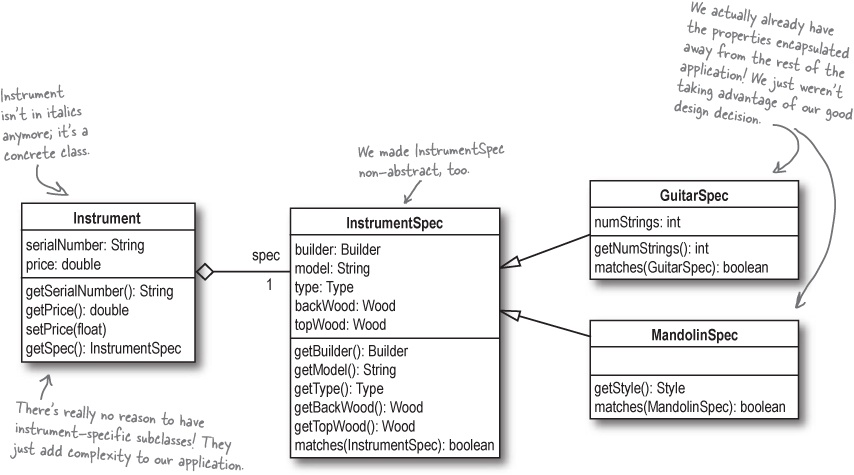

## Head First Object Oriented Design
#### Gathering requirements : (Use cases)
- Get the requirement in clean understanding before jump into solution
  - Get question and corner cases ready 
  - To make sure requirements are solid and well understood
  - To make it easy list down the steps or flows which will happen like interactions 
  - **most people expect things to work even if problems occur.** 
    - So you’ve got to anticipate what might go wrong, 
    - and add requirements to take care of those problems as well. 
  - That means you’ve got to really understand what the system has to do, and how your customers are going to use it.
  - **_You have to come up with all the BAD things that might come up and solve those_**
    - To picture these, follow steps and ask 
    - does this step happen like this only what if he does not follow happy path , what are the other paths/option he has. 
      - like person is going to upload file, does he is doing to upload any file
  - Use Case : 
    - one of the key points about a use case is that it is focused on accomplishing one particular goal. 
    - If your system does more than one thing—
      - like let File upload and track how many times upload activity occurred an entire day—then you’ll need more than one use case.
  - All the BAD use cases /alternate path need to be setup and check with Unit tests and integration tests
#### Requirement Change
- In real world, requirement always change as previous product delivered is used
- Sometimes a change in requirements reveals problems with your system that you didn’t even know were there.

#### Software into real world
- Software will be given in real world, has to think from their lenses, it can have multiple scenarios and different type of users
- **Analysis** : 
  - Identify the problem
  - your use cases let you show customers, managers, and other developers how your system works in a real world context.
- To design loosely couple application :
  - Need to delegate the functionality to respective classes like UploadValidator etc.
  - Think from object perspective , 
    - don't go for single fields or working around it, ask yourself , 
      - does this fall into separate functionality , 
      - shall i make it separate class ?
- **_Really important: the nouns in a use case are usually the classes you need to write and focus on in your system._**
  - Like in File Upload use case, File is very important, you can ask many questions around it like 
    - Type of File, Size of File etc.
    - Design application around that.
    - You really don’t need to focus too much on grammar. 
      - Just write your use cases in conversational English (or whatever language you speak and write in). 
      - Then figure out what the “things” are in your use case—those are generally the nouns. For each noun, think about if you need a class to represent it, 
      - and you’ve got a good start on a real-world analysis of your system
  - **_Entity class/Object Class : Almost every noun in use case is the classes in application_**
- Correct Requirements/Use cases make the application useful to customer and cover all the path, so always try to get requirement clear
- When you write your use case, reread it, and make sure that it makes sense to you. You might even want to let a couple of friends or co-workers read through it, too, and make sure it will work in the real world, not just in a controlled environment.
- UML diagrams of class are important : 
  - Rewriting code takes a lot more time than rewriting a use case or redrawing a class diagram...
  - Arrow from one class to another , mention that target is field in calling class, 
    - like Arrow can be from Employee -> Address
- Each use case should focus on only one customer goal. If you have multiple goals, you will need to write multiple use cases.
- It gives us a way to avoid multiple classes just for different behaviour , 
  - like in Type of instrument, we were extending classes, which can be delay as subclass of specification
  - ```
    Banjo extends Instrument{
     public Banjo(String name, InstrumentSpec)
    }
    ```
  - To have separate concrete class of Instrument as a one , dont have separate classes for each and every instrument 
    - You can structure it as below
    
    - As the above image explain , how we made Instrument class as a concrete class and extends the behaviour to specific class
    - Now, we dont need to create new class of every Instrument since every details are given to SpecificClass
    - Whenever someone want to search instruments or do some filters, they just have to invoke ``matches(InstrumentSpec)`` method
      - Since every spec is concrete class, we will pass that in matches method, it will behave it respectively 
   