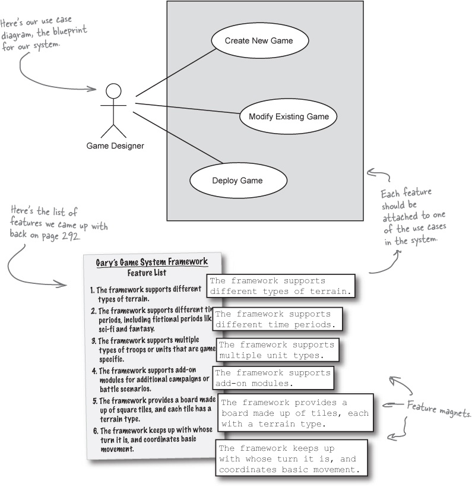

## Head First Object Oriented Design
#### Gathering requirements : (Use cases)
- Get the requirement in clean understanding before jump into solution
  - Get question and corner cases ready 
  - To make sure requirements are solid and well understood
  - To make it easy list down the steps or flows which will happen like interactions 
  - **most people expect things to work even if problems occur.** 
    - So you’ve got to anticipate what might go wrong, 
    - and add requirements to take care of those problems as well. 
  - That means you’ve got to really understand what the system has to do, and how your customers are going to use it.
  - **_You have to come up with all the BAD things that might come up and solve those_**
    - To picture these, follow steps and ask 
    - does this step happen like this only what if he does not follow happy path , what are the other paths/option he has. 
      - like person is going to upload file, does he is doing to upload any file
  - Use Case : 
    - one of the key points about a use case is that it is focused on accomplishing one particular goal. 
    - If your system does more than one thing—
      - like let File upload and track how many times upload activity occurred an entire day—then you’ll need more than one use case.
  - All the BAD use cases /alternate path need to be setup and check with Unit tests and integration tests
#### Requirement Change
- In real world, requirement always change as previous product delivered is used
- Sometimes a change in requirements reveals problems with your system that you didn’t even know were there.

#### Software into real world
- Software will be given in real world, has to think from their lenses, it can have multiple scenarios and different type of users
- **Analysis** : 
  - Identify the problem
  - your use cases let you show customers, managers, and other developers how your system works in a real world context.
- To design loosely couple application :
  - Need to delegate the functionality to respective classes like UploadValidator etc.
  - Think from object perspective , 
    - don't go for single fields or working around it, ask yourself , 
      - does this fall into separate functionality , 
      - shall i make it separate class ?
- **_Really important: the nouns in a use case are usually the classes you need to write and focus on in your system._**
  - Like in File Upload use case, File is very important, you can ask many questions around it like 
    - Type of File, Size of File etc.
    - Design application around that.
    - You really don’t need to focus too much on grammar. 
      - Just write your use cases in conversational English (or whatever language you speak and write in). 
      - Then figure out what the “things” are in your use case—those are generally the nouns. For each noun, think about if you need a class to represent it, 
      - and you’ve got a good start on a real-world analysis of your system
  - **_Entity class/Object Class : Almost every noun in use case is the classes in application_**
- Correct Requirements/Use cases make the application useful to customer and cover all the path, so always try to get requirement clear
- When you write your use case, reread it, and make sure that it makes sense to you. You might even want to let a couple of friends or co-workers read through it, too, and make sure it will work in the real world, not just in a controlled environment.
- UML diagrams of class are important : 
  - Rewriting code takes a lot more time than rewriting a use case or redrawing a class diagram...
  - Arrow from one class to another , mention that target is field in calling class, 
    - like Arrow can be from Employee -> Address
- Each use case should focus on only one customer goal. If you have multiple goals, you will need to write multiple use cases.
- It gives us a way to avoid multiple classes just for different behaviour , 
  - like in Type of instrument, we were extending classes, which can be delay as subclass of specification
  - ```
    Banjo extends Instrument{
     public Banjo(String name, InstrumentSpec)
    }
    ```
  - To have separate concrete class of Instrument as a one , dont have separate classes for each and every instrument 
    - You can structure it as below
    
    - As the above image explain , how we made Instrument class as a concrete class and extends the behaviour to specific class
    - Now, we dont need to create new class of every Instrument since every details are given to SpecificClass
    - Whenever someone want to search instruments or do some filters, they just have to invoke ``matches(InstrumentSpec)`` method
      - Since every spec is concrete class, we will pass that in matches method, it will behave it respectively 

#### Solving Really Big Problem
  - Every big problem is solved once you solve the small problems of this big problem
  - **_Points to be considered_**
    - By encapsulating what varies, you make your application more flexible, and easier to change.
    - Coding to an interface, rather than to an implementation, makes your software easier to extend.
    - The best way to get good requirements is to understand what a system is supposed to do.
    - Analysis helps you ensure your system works in a real-world context.
  - **Use case diagrams**
    - Sometimes you need to know what a system does, but don’t want to get into all the detail that use cases require. When you’re in a situation like this, a use case diagram could be just what you need:
    - Take your use case diagram, and make sure that all the use cases you listed will cover all the features you got from the customer like below
     
    - **Domain analysis**
      - Once use cases are completed, check for domain analysis of every use cases like responsibility of every class/module
      - To be specific : 
        - Have all the feature list of every use cases
        - Explain how they are solving big problem, make sure all use cases are covered
      - Once every requirement is covered , now use
      - **_Divide and Conquer_**
    - Don’t forget who your customer really is
      - Solve for those people only and their perspective and use cases are covered
      - Always ask yourself if this use cases belong to your module or application

#### Architecture: Bringing Order to Chaos
  - Architecture is the organizational structure of a system, including its decomposition into parts, their connectivity, interaction mechanisms, and the guiding principles and decisions that you use in the design of a system.
  - Even if we know to start by focusing on functionality, we still need to figure out which pieces are the most important. Those are the pieces we want to focus on first.
  - **The three Qs of architecture**
    - Is it part of the essence of the system?
      - Is the feature really core to what a system actually is? Think about it this way: can you imagine the system without that feature? If not, then you’ve probably found a feature that is part of the essence of a system.
    - What the heck does it mean?
      - If you are not sure what this particular feature mean or works , get it first clear on priority
    - How the “heck” do I do it? 
      - features that seem really hard to implement, or are totally new programming tasks for you. If you have no idea how you’re going to tackle a particular problem, you better spend some time up front looking at that feature, 
      - so it doesn’t create lots of problems down the road.
    - All the Q's answer are basically the solving the RISK for project, hence you can work on parallel to solve those all Q's
      - The reason that these features are architecturally significant is that they all introduce RISK to your project. It doesn’t matter which one you start with—as long as you are working towards reducing the RISKS in succeeding.
    - Reducing risk : 
      - Since three Q's are here to help you with Reducing RISK,
      - But you also need to find all the scenario's, like designing Board for GAME, think of scenario's using board for playing game.
      - A scenario gives us lots of the advantages of a use case, without forcing us to get into lots of detail that we don’t need to worry about right now.
  - Adding unnecessary complicated requirement lead to we’re trying to reduce risk, not increase it by going with a solution that is a lot more complex than we really need.
  - Find the Commonality in use cases classes encapsulate those to make it more flexible.
  - OOA&D is all about code—it’s about writing great software, every time. 
    - But the way you get to good code isn’t always by sitting down and writing it right away. 
    - Sometimes the best way to write great code is to hold off on writing code as long as you can. 
    - Plan, organize, architect, understand requirements, reduce risks... all these make the job of actually writing your code very simple.

#### Design Principles: Originality is Overrated
   - **_Design principle roundup_**
     - Gathering requirements, analysis, writing out feature lists, and drawing use case diagrams. Of course, at some point you actually are going to have to write some code. And that’s where design principles really come into play.
     - **_Principle #1: The Open-Closed Principle (OCP)_**
       - Inheritance & Compositions are some examples of OCP
       - It’s really a combination of encapsulation and abstraction. 
         - You’re finding the behavior that stays the same, and abstracting that behavior away into a base class, 
         - and then locking that code up from modification. But then when you need new or different behavior, 
         - your subclasses handle the changes by extending the base class. That’s where encapsulation comes in: 
         - you’re encapsulating what varies (behavior in the subclasses) away from what stays the same (the common behavior in the base class).
     - **_Principle #2: The Don’t Repeat Yourself Principle (DRY)_**
       - Let’s abstract out the common code
       - remove the code from other locations
       - reference the code from Step #1
     - **_Principle #3: The Single Responsibility Principle (SRP)_**
       - When we used a Map to store properties for all types of units in the Unit class, we were using the SRP. 
         - So instead of having game-specific Units have to deal with their properties, 
         - and still have the base Unit class dealing with a different set of properties, 
         - we moved all property-related functionality into the nit class. So handling the properties feature is taken care of in ONE single place—the Unit class.
     - **_Contestant #4: The Liskov Substitution Principle (LSP)_**
       - The LSP is all about well-designed inheritance. When you inherit from a base class, you must be able to substitute your subclass for that base class without things going terribly wrong. Otherwise, you’ve used inheritance incorrectly!
       - When you use inheritance, your subclass gets all the methods from its superclass, even if you don’t want those methods. And if you’ve used inheritance badly, then you’re going to end up with a lot of methods that you don’t want
       - This principle is not always about inheritance , sometime composition can be use just to delegate or override the properties
         - Delegate behavior to another class when you don’t want to change the behavior, but it’s not your object’s responsibility to implement that behavior on its own.
       - Composition
         - Composition is a restricted form of Aggregation in which two entities are highly dependent on each other.
         - Like Vehicle -> Tyre , Engine, If vehicle is destroyed, tyre & engine will also be gone.
       - Aggregation
         - It is a special form of Association where:
         - both entries can survive individually which means ending one entity will not affect the other.
         - Like Student -> Department -> Institute etc.


