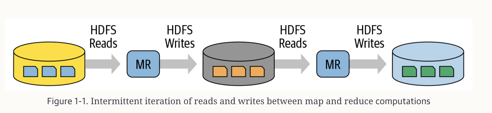
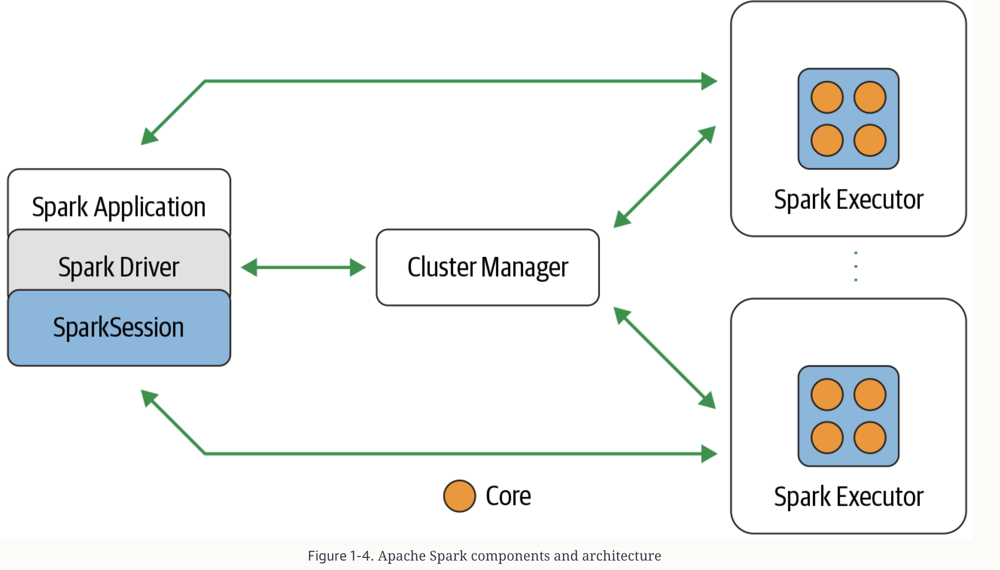

## Learning Spark: 2nd Edition
#### Introduction to Apache Spark : (Why and What is)
- **_Why we require spark ?_**
  - Initially when hadoop and MR(Map reduce) framework is used, but it has below problems
    - It was hard to manage and administer
    - Batch-processing MapReduce API was verbose and required a lot of boilerplate setup code, with brittle fault tolerance
    - With large batches of data jobs with many pairs of MR tasks 
      - Each pair’s intermediate computed result is written to the local disk for the subsequent stage of its operation 
         
      - This repeated performance of disk I/O took its toll: large MR jobs could run for hours on end, or even days.
- **_What is apache spark ?_**
  - Spark provides in-memory storage for intermediate computations, making it much faster than Hadoop MapReduce.
  - Speed : 
    - worked on cheap commodity servers
    - work as DAG which every task can work parallel on different executors
    - Tungsten Engine : make core more compact and execute
  - Ease of Use : 
    - With RDD it provides an abstract layer
    - With Operation like Transformation , Action help in ease of use
- **_Apache spark Architecture?_**
  - Consists of a Driver program that is responsible for orchestrating parallel operations on the Spark cluster
 