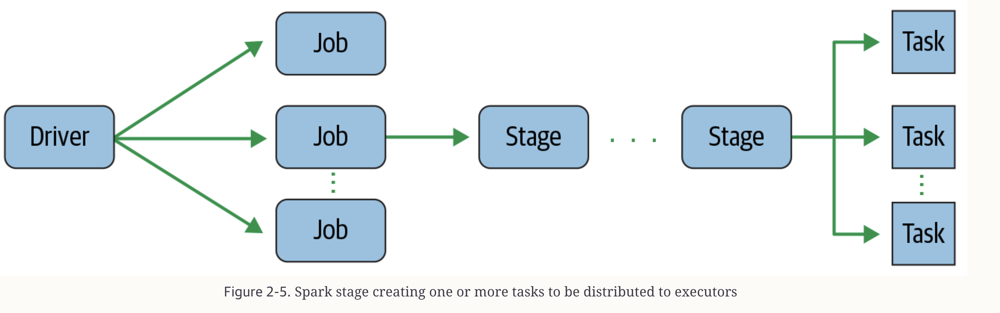

## Learning Spark: 2nd Edition
#### Introduction to Apache Spark : (Why and What is)
- **_Why we require spark ?_**
  - Initially when hadoop and MR(Map reduce) framework is used, but it has below problems
    - It was hard to manage and administer
    - Batch-processing MapReduce API was verbose and required a lot of boilerplate setup code, with brittle fault tolerance
    - With large batches of data jobs with many pairs of MR tasks 
      - Each pair’s intermediate computed result is written to the local disk for the subsequent stage of its operation 
         
      - This repeated performance of disk I/O took its toll: large MR jobs could run for hours on end, or even days.
- **_What is apache spark ?_**
  - Spark provides in-memory storage for intermediate computations, making it much faster than Hadoop MapReduce.
  - Speed : 
    - worked on cheap commodity servers
    - work as DAG which every task can work parallel on different executors
    - Tungsten Engine : make core more compact and execute
  - Ease of Use : 
    - With RDD it provides an abstract layer
    - With Operation like Transformation , Action help in ease of use
- **_Apache spark Architecture?_**
  - Consists of a Driver program that is responsible for orchestrating parallel operations on the Spark cluster
 
  - Spark Driver : 
    - It is responsible for instantiating the spark session.
    - it communicates with the cluster manager; 
    - it requests resources (CPU, memory, etc.) from the cluster manager for Spark’s executors (JVMs); 
    - and it transforms all the Spark operations into DAG computations, schedules them, and distributes their execution as tasks across the Spark executors. 
    - Once the resources are allocated, it communicates directly with the executors.
  - Spark Session :
    - It became a unified conduit to all Spark operations
      - Through this define DataFrames and Datasets, read from data sources, access catalog metadata, and issue Spark SQL queries
      - ```scala
           // Build SparkSession
           val spark = SparkSession.builder.appName("LearnSpark").config("spark.sql.shuffle.partitions", 6).getOrCreate()
          // Use the session to read JSON
          val people = spark.read.json("...")
          // Use the session to issue a SQL query
          val resultsDF = spark.sql("SELECT city, pop, state, zip FROM table_name") 
        ```
      - In most deployments modes, only a single executor runs per node.
    - **_Distributed data and partitions_**
      - That is, each executor’s core is assigned its own data partition to work on
        - Spark executor can have multiple core and each core can map to different partition.
        - Each core can process one partition at a time, if you have multiple partition but limited cores per executors , it will take time.
      - Also what happen when partition size is more than executor memory
        - Refer memory structure : https://medium.com/swlh/spark-oom-error-closeup-462c7a01709d
        - If we tried to load big partition , it will be Out of Memory error for Executor
        - Hence, try to assist correct number of partitions while doing the application loading data.
          - ```python 
               # In Python
               log_df = spark.read.text("path_to_large_text_file").repartition(8)
               print(log_df.rdd.getNumPartitions()) 
            ```
#### Getting started Apache Spark : (Installation and concept)
  - Installation : 
    - Get details from : https://www.apache.org/dyn/closer.lua/spark/spark-3.5.4/spark-3.5.4-bin-hadoop3.tgz
    -Example to run sample spark app in shell is below with cmd ```./spark-submit mnmcount.py mnm_dataset.csv ```
    - You can get above files examples from here : https://github.com/databricks/LearningSparkV2/blob/master/chapter2/py/src/data/mnm_dataset.csv
      -   ```
          # In Spark Shell
          scala> val strings = spark.read.text("../README.md")
          strings: org.apache.spark.sql.DataFrame = [value: string]
          scala> strings.show(10, false)
          ```
  - Spark Application and SparkSession : 
    - Core of every Spark application is the Spark driver program, which creates a SparkSession object. 
      - When you’re working with a Spark shell, the driver is part of the shell and the SparkSession object (accessible via the variable spark)
    - **Spark Job** :
      - Driver converts your Spark application into one or more Spark jobs . 
      - It then transforms each job into a DAG. DAG into multiple stages
    - **Spark Stages**
      - DAG nodes are converted in multiple stages.
      - Stages are created based on what operations can be performed serially or in parallel
    - **Spark Job** :
      - Each stage is comprised of Spark tasks (a unit of execution), 
      - which are then federated across each Spark executor; 
      - each task maps to a single core and works on a single partition of data
      
  - Transformations, Actions, and Lazy Evaluation: 
    - All transformations are evaluated lazily. That is, their results are not computed immediately, but they are recorded or remembered as a lineage.
    - Nothing in a query plan is executed until an action is invoked
  - Narrow and Wide Transformations : 
    - Optimization can be done by either joining or pipelining some operations and assigning them to a stage, or breaking them into stages by determining which operations require a shuffle or exchange of data across clusters.
    - Narrow transformation : 
      - Any transformation where a single output partition can be computed from a single input partition is a narrow transformation
      - filter() and contains() represent narrow transformations because they can operate on a single partition and produce the resulting output partition without any exchange of data.
    - Wide Transformation : 
      - Transformations such as groupBy() or orderBy() instruct Spark to perform wide transformations, where data from other partitions is read in, combined, and written to disk

#### Apache Spark’s Structured APIs
- **_What’s Underneath an RDD?_**
  - RDD is divided into three part : 
  - Dependencies :
    - It defines the dependencies of data from which RDD can be constructed
  - Partition:
    - It defines the data parallelization in processing 
  - ComputeFunction (Partition => Iterator[T]):
    - It defines the computation logic on partitions, problem arise because compute function can is opaque like 
    - Spark does not know the function is select,aggregate etc. 
    - and also does not know the datatype hence spark will not be able to optimise. hence Dataframe,dataset came in picture.
  - operators like filtering, selecting, counting, aggregating, averaging, and grouping,
    - let you tell Spark what you wish to compute with your data, and as a result, it can construct an efficient query plan for execution.
- **_The DataFrame API_**
  - Dataframe are like distributed in-memory tables
  - Defining a schema up front as opposed to taking a schema-on-read approach offers three benefits
    - You relieve Spark from the onus of inferring data types.
    - You prevent Spark from creating a separate job just to read a large portion of your file to ascertain the schema, which for a large data file can be expensive and time-consuming.
    - You can detect errors early if data doesn’t match the schema. 


