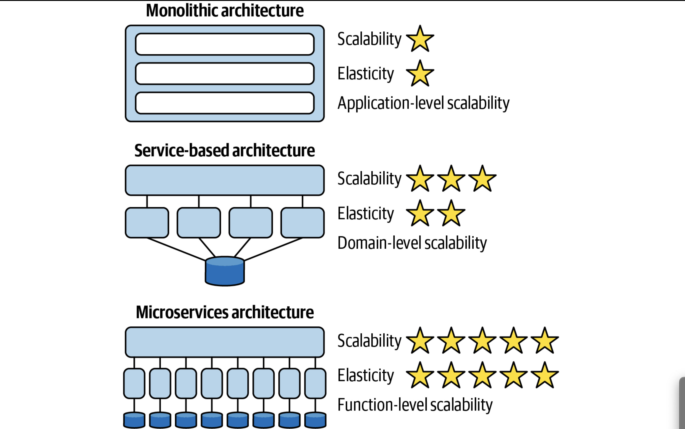

# Software Architecture: The Hard Parts : BooksSummary
 ##### Chapter 2 :
   - Trade-off analysis :
      - analyzing what parts are coupled to one another and what impact that coupling has on change 
   - Coupling : “architecture quantum definition goes further by identifying types of coupling—that’s where the static and dynamic stuff comes in”
     - Static : 
       - dependencies include operating system, frameworks and/or libraries delivered via transitive dependency management
       - “ describes how services are wired together”
       - “service must contain dependent components such as a database, representing static coupling”
       - “We were performing a reliability analysis to determine: 
         - if I change this thing, what might break, where thing could be anything in our architecture or operations. 
         - They’re trying to do risk mitigation—if we change a service, they want to know what must be tested.”
         - Like if RMQ is removed, what are the parts which needs to be check or tested
     - Dynamic : 
       - "quanta communicate at runtime, either synchronously or asynchronously"
       - “describes how services call one another at runtime”
       - scalability is the ability to support a large number of concurrent users
       - elasticity is the ability to support a burst of user requests in a short time frame
       - Example : 
         - “ Ticketing is operating at ten times the elastic scale of Assignment, 
           - and we need to make a call between them. If we make a synchronous call, the whole workflow will bog down, as the caller waits for the slower service to process and return. 
           - If on the other hand we make an asynchronous call, using the message queue as a buffer, we can allow the two services to execute operationally independently, 
             - allowing the caller to add messages to the queue and continue working, receiving notification when the workflow is complete.”
     - High Functional Cohesive : 
       - “refers structurally to the proximity of related elements: classes, components, services, and so on”
       - “in a microservices architecture, each service models a single domain or workflow, and therefore exhibits high functional cohesion.”
     - Single architecture quantum
       - Even Separate services with same/common DB can have single quorum
       - If services with different DB but console is same where these API's are integrated , then its single quorum
     - Dynamic Quantum : 
       - Consistency : general advice to try to avoid cross-service transactions
       - Co-ordination : coordination the workflow modeled by the communication requires. The two common generic patterns for microservices are orchestration and choreography 
##### Chapter 3 :
- Buying from Business team for refactoring :
    - To build a good business case for something of this magnitude you first need to understand the benefits of architectural modularity, 
    - match those benefits to the issues you are facing with the current system,
    - and finally analyze and document the trade-offs involved with breaking apart the application.
    - When merge/acquisition happen ,Scalability is a big part of mergers and acquisitions, as is agility and extensibility, all of which are architectural concerns.
- Architecture characteristics
  - “There is one thing that will separate the pack into winners and losers: the on-demand capability to make bold and decisive course-corrections that are executed effectively and with urgency.”
  - Agility : 
    - “Speed-to-market is achieved through architectural agility—the ability to respond quickly to change”
    - “including maintainability, testability, and deployability.”
- Maintainability : 
  - “is about the ease of adding, changing, or removing features, as well as applying internal changes such as maintenance patches, framework upgrades, third-party upgrades, and so on”
  - “the change scope of the new requirement is at a domain-level within a particular domain service, making it easier to isolate the specific deployment unit requiring the change.”
- Testability :
  - “ Even if a monolithic application did have a suite of full regression tests, imagine the frustration of having to execute hundreds or even thousands of unit tests for a simple code change. 
  - Not only would it take a long time to execute all of the tests, but the poor developer would be stuck researching why dozens of tests failed when in fact the failed tests have nothing to do with the change.”
- Deployability :
  - “ease of deployment—it is also about the frequency of deployment and the overall risk of deployment”
  - “If your microservices must be deployed as a complete set in a specific order, please put them back in a monolith and save yourself some pain.”
- Scalability : 
  - “system to remain responsive as user load gradually increases over time”
- Elasticity : 
  - “elasticity, which is defined as the ability of a system to remain responsive during significantly”
  - “also have the ability to instantaneously start up additional services to handle the spike in traffic. 
  - Elasticity relies on services having a very small mean time to startup (MTTS), which is achieved architecturally by having very small, fine-grained services”
  - “it is important to keep synchronous communication between services to a minimum when requiring high levels of scalability and elasticity”
  - Refer to :
  - 
##### Chapter 4 :
- Architectural decomposition :
  - To divide a monolith application into microservices
    - Two ways to look at it :
      - Component base composition
        - When application code is well written and definable components like packages ,
        - proper segregation, you just need to extract those and form new services etc
      - Tactical forking: 
        - Its like sculpture create beautiful art from big/whole marble
        - When there is no proper boundaries and code is very diversified, you will replicate code in another repo and start removing to form separate service
- Afferent and Efferent Coupling :
  - To determine whether codebase is decomposable 
  - Two ways to look at it :
    - Afferent
      - No of incoming connection to code artifact like classes,component etc
    - Efferent:
      - No of outgoing connection to code artifact like classes,component etc
    - **Check out the JDepend plugin of eclipse to realise the dependencies of various classes**
    - Abstraction , Instability and Distance from main sequence
    - 